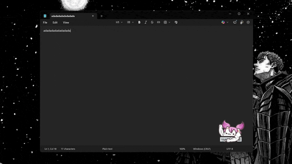

# 🐱 Bongo Cat Auto-Clicker


A Python script designed to simulate ultra-fast drumming for Bongo Cat desktop (Steam version). Unlike standard clickers, this uses hardware-level input simulation to ensure the app registers every single hit.

## ✨ Features

- **Braille UI:** ASCII art to improve the terminal interface.
- **Speed:** Capable of hundreds of hits per second (fully adjustable).
- **Safe Start Toggle:** Two button combo start to prevent accidental activation.
- **Stop Button:** Instant stop with a single keypress.

### 📽️ Demo

<p align="center">
  
</p>

## 🛠️ Setup & How to Run

1. **Install Python:** Download the official [Python](https://www.python.org/) installer. **Make sure to check "Add Python to PATH" during installation.**
2. **Install Dependencies:** Open your terminal (PowerShell) and run:
   ```bash
   pip install -r requirements.txt
   ```

Once setup is done, choose **ONE** of the following ways to start the script:

### Option A: Using VS Code

1. Right-click **VS Code** and select **Run as Administrator**.
2. Open the project folder and select `main.py`.
3. Press the **Play Button** in the top right or hit `CTRL` + `F5`.

### Option B: Using Terminal (Easiest)

1. Search for **PowerShell** in your Start Menu.
2. Right-click it and select **Run as Administrator**.
3. Navigate to your folder (e.g., `cd C:\BongoCatAutoClicker`).
4. Run the script by typing:
   ```powershell
   python main.py
   ```

### 💡 PRO TIP

**For best results:** Open a Notepad app and make sure it is your current active window. As shown in the demo GIF, this script types `a` and `d` rapidly. Having a text document active prevents the script from accidentally triggering shortcuts in other applications.

## 🎮 Controls

| Action             | Key Combination            |
| :----------------- | :------------------------- |
| **Start Drumming** | `CTRL` + `F8`              |
| **Stop Drumming**  | `ESC`                      |
| **Exit Program**   | `ESC` (while not drumming) |

## ⚙️ Customization

You can tweak the performance by opening `main.py` and changing these values:

- `HOLD_TIME`: How long the paw stays down. Lower = faster, but Steam may stop registering hits if set below `0.03`.
- `GAP_TIME`: The delay between the left and right paw. Set to `0` for maximum speed.
- `LEFT_PAW` / `RIGHT_PAW`: Change these if you want to use different keys (default is `a` and `d`).

## ⚠️ Troubleshooting

- **Cat isn't moving?** Ensure Bongo Cat or Notepad window is the "Active" window (click on it) before starting the script.
- **Keys not registering?** Make sure you ran your VS Code as **Administrator**. Windows blocks non-admin scripts from sending inputs to other apps for security.

---

_Maintained with ❤️ for the Bongo Cat community._
